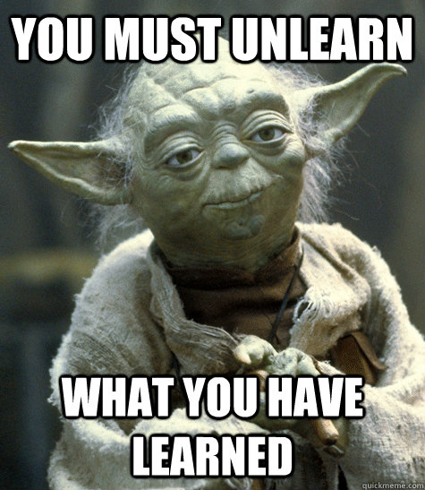

 
  
# **Background**
**Statistics**: making inferences about an uncertain world using samples of observations (data)

The bedrock of statistics is probability theory. Much early work in probability and statistics was done by Bayesians. In the late 19$^{th}$ and early 20$^{th}$ centuries, statistics was taken over by Fisher and the frequentists. The exponential growth in human computing power and advent of sampling algorithms like MCMC during the 20$^{th}$ made previously intractible problems solvable. Today the debate between these philosophies of statistics is over among mathemeticians and statisticians.

## **Statistics now**

Whichever school of thought  you choose, inference is moving away from tests of 'significance' and $p$ values, focusing more on making inference about parameter estimates and their uncertainty (i.e., estimates and CI's).  

A very recent [paper](https://www.nature.com/articles/d41586-019-00857-9) in Nature calls for the retirement of $p$ values and suggests rebranding confidence intervals and credible intervals as 'compatibility intervals'. Both 'confidence' and 'credible' are somewhat loaded terms. Inferences made from data and models are only _credible_ (or you can only have _confidence_ in the inferences) if the assumptions you've made in collecting the data and building the model are correct (remembering all models wrong, some useful). Instead, we should consider point and interval estimates from a model to be _compatible_ with the data and assumed model structure.  
  
Check out Richard McElreath's [book](https://xcelab.net/rm/statistical-rethinking/) and [lectures](https://www.youtube.com/watch?v=4WVelCswXo4&list=PLDcUM9US4XdNM4Edgs7weiyIguLSToZRI) 
 

    
The difference between Bayesian and Classical (a.k.a. frequentist) inference is subtle.  

  
## **Freqentist:** 
* Data are random.  
* Parameters ($\theta$) are fixed, but uncertain.
* Estimate $\theta$ as the value that maximizes $P(data|\theta)$ (maximum likelihood)
* Parameter estimates interpreted in terms of long-run frequency of outcomes in hypothetical repeated experiments.  
* A 95% _confidence_ interval is interpreted as:  
"if the experiment were repeated a large number of times, the 'true' $\theta$ would fall within this range 95% of the time.
     
## **Bayesian:** 
* Data are fixed. 
* Parameters ($\theta$) are random
* Estimate $P(\theta|data)$ using Bayes' rule:$$ P(\theta|data)\propto \frac{P(data|\theta)P(\theta)}{P(data)}$$
* MCMC is the the engine that gets us our answer.  
* Parameter estimates are a probability distribution, interpretation is thus very straightforward.
* Posterior estimates can be interpreted the way most people probably _think_ about traditional confidence intervals.  
*A 95% credible interveral would be interpreted as:
"Given these data and this model, there is a 95% chance $\theta$ lies in this range".  

## Why go Bayesian?  
 
**Reasons for:**  

* Straightforward interpretation of results (direct probability statements about parameters).
* Propagation of uncertainty (compatibility intervals on everything for _FREE_!!).  
* Tests for differences very straightforward, allow you to calculate probability of a difference.
* Approachable modeling notation, which provides a 'common tongue' for modelers to share ideas transparently.

     + JAGS models are written almost entirely in the mathematical notation you would to describe a model in a write-up.
     + Stan is too, but its syntax is a bit more complicated. I've found learning the basics of Bayesian inference to be easier with JAGS models.

**Caveats**  

* There is a bit more overhead in terms of model setup and obtaining results:  
     + Determining appropriate priors
     + Tuning the model to reach convergence
     + Computation time
  